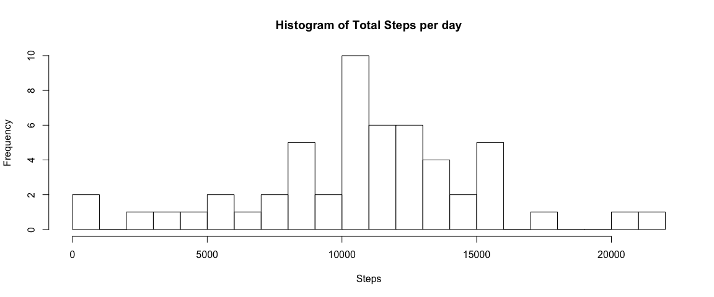
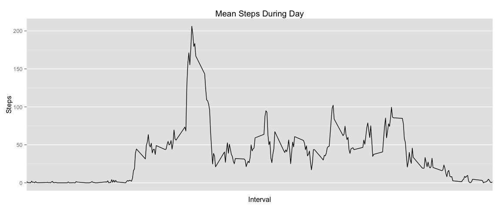
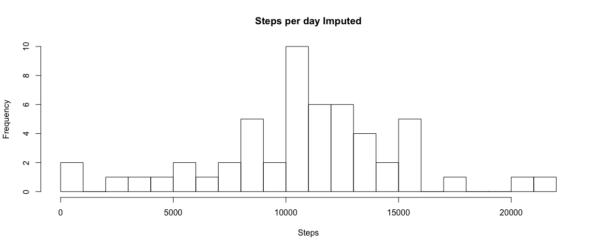
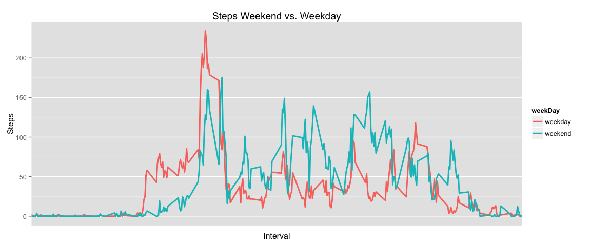

# Reproducible Research: Peer Assessment 1


## Loading and preprocessing the data

```r
#Load Data
activity = read.csv("activity.csv")
```

## What is mean total number of steps taken per day?

####1. Calculate the total number of steps taken per day


```r
activity.StepsPerDay = aggregate(activity$steps,
                                 by=list(activity$date),FUN = sum)
names(activity.StepsPerDay) = c("date","avg_steps")
activity.StepsPerDay
```

```
##          date avg_steps
## 1  2012-10-01        NA
## 2  2012-10-02       126
## 3  2012-10-03     11352
## 4  2012-10-04     12116
## 5  2012-10-05     13294
## 6  2012-10-06     15420
## 7  2012-10-07     11015
## 8  2012-10-08        NA
## 9  2012-10-09     12811
## 10 2012-10-10      9900
## 11 2012-10-11     10304
## 12 2012-10-12     17382
## 13 2012-10-13     12426
## 14 2012-10-14     15098
## 15 2012-10-15     10139
## 16 2012-10-16     15084
## 17 2012-10-17     13452
## 18 2012-10-18     10056
## 19 2012-10-19     11829
## 20 2012-10-20     10395
## 21 2012-10-21      8821
## 22 2012-10-22     13460
## 23 2012-10-23      8918
## 24 2012-10-24      8355
## 25 2012-10-25      2492
## 26 2012-10-26      6778
## 27 2012-10-27     10119
## 28 2012-10-28     11458
## 29 2012-10-29      5018
## 30 2012-10-30      9819
## 31 2012-10-31     15414
## 32 2012-11-01        NA
## 33 2012-11-02     10600
## 34 2012-11-03     10571
## 35 2012-11-04        NA
## 36 2012-11-05     10439
## 37 2012-11-06      8334
## 38 2012-11-07     12883
## 39 2012-11-08      3219
## 40 2012-11-09        NA
## 41 2012-11-10        NA
## 42 2012-11-11     12608
## 43 2012-11-12     10765
## 44 2012-11-13      7336
## 45 2012-11-14        NA
## 46 2012-11-15        41
## 47 2012-11-16      5441
## 48 2012-11-17     14339
## 49 2012-11-18     15110
## 50 2012-11-19      8841
## 51 2012-11-20      4472
## 52 2012-11-21     12787
## 53 2012-11-22     20427
## 54 2012-11-23     21194
## 55 2012-11-24     14478
## 56 2012-11-25     11834
## 57 2012-11-26     11162
## 58 2012-11-27     13646
## 59 2012-11-28     10183
## 60 2012-11-29      7047
## 61 2012-11-30        NA
```

####2. Make a histogram of the total number of steps taken each day

```r
hist(activity.StepsPerDay$avg_steps,
     main = "Histogram of Total Steps per day",
     xlab = "Steps",
     breaks = 20)
```

 

####3. Calculate and report the mean and median of the total number of steps taken per day


```r
steps.mean = format(na.omit(mean(activity.StepsPerDay$avg_steps,na.rm = TRUE)))
steps.median = na.omit(median(activity.StepsPerDay$avg_steps,na.rm = TRUE))
```

The mean total number of steps taken per day is 10766.19.

The median total number of steps taken per day is 10765


## What is the average daily activity pattern?

####1. Make a time series plot (i.e. type = "l") of the 5-minute interval (x-axis) and the average number of steps taken, averaged across all days (y-axis)


```r
#Create table with time series plot of 5 minute interval and  number of steps
avgStepInterval = aggregate(activity$steps,by=list(activity$interval),FUN = mean,na.rm = TRUE)
names(avgStepInterval) = c("interval","avg_steps")

#Create time series
library(ggplot2)
ggplot(avgStepInterval, aes(interval, avg_steps)) + 
    geom_line() +
    xlab("Interval") + 
    ylab("Steps") +
    ggtitle("Mean Steps During Day") +
    scale_x_discrete(breaks=NULL)
```

 

####2. Which 5-minute interval, on average across all the days in the dataset, contains the maximum number of steps?


```r
x = max(avgStepInterval$avg_steps)
interval = avgStepInterval[avgStepInterval$avg_steps == x,c("interval")]
avg_steps = format(avgStepInterval[avgStepInterval$avg_steps==x,c("avg_steps")])
```

The five minute interval, on average across all the days in the data set that contains the maximum number of steps is 835 with a total 
of 206.1698 steps.


## Imputing missing values

####1. Calculate and report the total number of missing values in the dataset (i.e. the total number of rows with NAs)

```r
na.rows = format(nrow(activity[is.na(activity$steps),]))
```

The number of missing values is 2304

####2. Devise a strategy for filling in all of the missing values in the dataset. The strategy does not need to be sophisticated. For example, you could use the mean/median for that day, or the mean for that 5-minute interval, etc.

My strategy is to remove all dates where no data was recorded at all, and replace the NA values with the median of that interval across all days.  I considered the mean of the day; however, the intervals appear much more correlated than the average across the entire day.  This is likey because people stick to simlar walking and sleeping patterns during the day


```r
#Remove dates with no data from activity
avgStep = aggregate(activity$steps,by = list(activity$date),FUN = mean,na.rm = TRUE)
names(avgStep) = c("date","avg_steps")
badDates = avgStep[is.na(avgStep$avg_steps),c('date')]
activity.impute = activity[!(activity$date %in% badDates),]
summary(activity.impute)
```

```
##      steps                date          interval     
##  Min.   :  0.00   2012-10-02:  288   Min.   :   0.0  
##  1st Qu.:  0.00   2012-10-03:  288   1st Qu.: 588.8  
##  Median :  0.00   2012-10-04:  288   Median :1177.5  
##  Mean   : 37.38   2012-10-05:  288   Mean   :1177.5  
##  3rd Qu.: 12.00   2012-10-06:  288   3rd Qu.:1766.2  
##  Max.   :806.00   2012-10-07:  288   Max.   :2355.0  
##                   (Other)   :13536
```

```r
#Fill in missing values with the average value for that time interval
avgInterval = aggregate(activity.impute$steps,by = list(activity.impute$interval),FUN = mean)
names(avgInterval) = c("interval","avg_steps")
activity.impute = merge(activity.impute,avgInterval, by = "interval",all.x = TRUE)
summary(activity.impute)
```

```
##     interval          steps                date         avg_steps      
##  Min.   :   0.0   Min.   :  0.00   2012-10-02:  288   Min.   :  0.000  
##  1st Qu.: 588.8   1st Qu.:  0.00   2012-10-03:  288   1st Qu.:  2.486  
##  Median :1177.5   Median :  0.00   2012-10-04:  288   Median : 34.113  
##  Mean   :1177.5   Mean   : 37.38   2012-10-05:  288   Mean   : 37.383  
##  3rd Qu.:1766.2   3rd Qu.: 12.00   2012-10-06:  288   3rd Qu.: 52.835  
##  Max.   :2355.0   Max.   :806.00   2012-10-07:  288   Max.   :206.170  
##                                    (Other)   :13536
```

####3. Create a new dataset that is equal to the original dataset but with the missing data filled in.


```r
#Upate activity.impute with steps_final to fill in min for missing data
library(data.table)
activity.final = data.table(activity.impute)
activity.final = activity.final[,steps_final := ifelse(is.na(steps),avg_steps,steps)]
summary(activity.impute)
```

```
##     interval          steps                date         avg_steps      
##  Min.   :   0.0   Min.   :  0.00   2012-10-02:  288   Min.   :  0.000  
##  1st Qu.: 588.8   1st Qu.:  0.00   2012-10-03:  288   1st Qu.:  2.486  
##  Median :1177.5   Median :  0.00   2012-10-04:  288   Median : 34.113  
##  Mean   :1177.5   Mean   : 37.38   2012-10-05:  288   Mean   : 37.383  
##  3rd Qu.:1766.2   3rd Qu.: 12.00   2012-10-06:  288   3rd Qu.: 52.835  
##  Max.   :2355.0   Max.   :806.00   2012-10-07:  288   Max.   :206.170  
##                                    (Other)   :13536
```

####4. Make a histogram of the total number of steps taken each day and Calculate and report the mean and median total number of steps taken per day. Do these values differ from the estimates from the first part of the assignment? What is the impact of imputing missing data on the estimates of the total daily number of steps?


```r
#Prep data for histogram
activity.final.StepsPerDay = aggregate(activity.final$steps_final,by = list(activity.final$date),FUN = sum)
names(activity.final.StepsPerDay) = c("date","avg_steps")

hist(activity.final.StepsPerDay$avg_steps,
     main = "Steps per day Imputed",
     xlab = "Steps",
     breaks = 20)
```

 

```r
steps.final.mean = format(na.omit(mean(activity.final.StepsPerDay$avg_steps,na.rm = TRUE)))
steps.final.median = format(median(activity.final.StepsPerDay$avg_steps,na.rm = TRUE))
```

The steps per day in the imputed file mean is 10766.19 and median is 
10765.  They are both exactly the same as the other mean and median
because the prior analysis excluded NA values, and because we included mean values 
it did not change anything.

## Are there differences in activity patterns between weekdays and weekends?

####1. Create a new factor variable in the dataset with two levels – “weekday” and “weekend” indicating whether a given date is a weekday or weekend day.


```r
#Convert date to data type
activity.final[,date := as.Date(date,"%Y-%m-%d")]
activity.final[,dayOfWeek := weekdays(activity.final$date)]
activity.final[dayOfWeek %in% c("Saturday","Sunday"),weekDay := "weekend"]
activity.final[!(dayOfWeek %in% c("Saturday","Sunday")),weekDay := "weekday"]
str(activity.final)
```

```
## Classes 'data.table' and 'data.frame':	15264 obs. of  7 variables:
##  $ interval   : int  0 0 0 0 0 0 0 0 0 0 ...
##  $ steps      : int  0 0 0 0 0 0 10 0 0 0 ...
##  $ date       : Date, format: "2012-10-02" "2012-11-21" ...
##  $ avg_steps  : num  1.72 1.72 1.72 1.72 1.72 ...
##  $ steps_final: int  0 0 0 0 0 0 10 0 0 0 ...
##  $ dayOfWeek  : chr  "Tuesday" "Wednesday" "Tuesday" "Monday" ...
##  $ weekDay    : chr  "weekday" "weekday" "weekday" "weekday" ...
##  - attr(*, ".internal.selfref")=<externalptr> 
##  - attr(*, "index")= atomic  
##   ..- attr(*, "__dayOfWeek")= int  8 14 16 30 37 45 53 57 67 73 ...
```

####2. Make a panel plot containing a time series plot (i.e. type = "l") of the 5-minute interval (x-axis) and the average number of steps taken, averaged across all weekday days or weekend days (y-axis). See the README file in the GitHub repository to see an example of what this plot should look like using simulated data.


```r
#Get average steps by interval and Weekend vs Weekday
activity.plot = with(activity.final,aggregate(steps_final,by =list(weekDay,interval),FUN = mean))
names(activity.plot) = c("weekDay","interval","steps_final")

library(ggplot2)
ggplot(activity.plot,aes(interval,steps_final,color=weekDay)) + 
    geom_line(size = 1) +
    ggtitle("Steps Weekend vs. Weekday") +
    xlab("Interval") +
    ylab("Steps") +
    scale_x_discrete(breaks=NULL)
```

 


